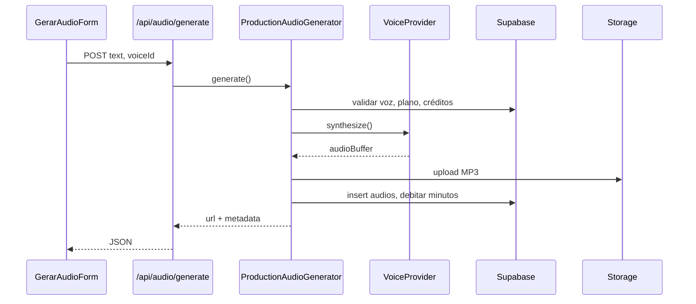

# Modelo próprio de voz IA — VoxKraft

Documento técnico de arquitetura para evolução do motor de Text-to-Speech (TTS), do MVP atual até um **modelo proprietário VoxKraft** focado em vozes brasileiras.

---

## 1. Estratégia em fases

### Fase 1 — MVP (atual)

**Objetivo:** validar produto, UX e monetização sem investimento pesado em ML.

| Aspecto | Implementação |
|---------|----------------|
| Síntese | Provedor externo (ElevenLabs) ou modo **demo** (localStorage + `/audio/demo.mp3`) |
| Vozes | Catálogo estático + tabela `voices` no Supabase |
| Armazenamento | Supabase Storage (produção) ou localStorage (demo) |
| Créditos | Minutos por plano na tabela `subscriptions` |

**Critério de saída:** fluxo completo (cadastro → gerar → histórico → dashboard) estável em produção.

---

### Fase 2 — Abstração multi-provedor

**Objetivo:** desacoplar o app do ElevenLabs via `VoiceProvider`.

| Provedor | Papel |
|----------|--------|
| `demo` | MVP local, sem servidor de síntese |
| `elevenlabs` | Produção inicial |
| `voxkraft` | Stub → motor próprio |

Variável de ambiente: `VOICE_PROVIDER=elevenlabs|demo|voxkraft`

**Critério de saída:** trocar provedor por config, sem alterar UI nem contratos do dashboard.

---

### Fase 3 — Serviço TTS dedicado

**Objetivo:** extrair síntese para serviço isolado (container / GPU).

```
┌─────────────┐     POST /api/tts      ┌──────────────────┐
│  Next.js    │ ─────────────────────► │  TTS Service     │
│  (VoxKraft) │ ◄───────────────────── │  (Python/FastAPI)│
└─────────────┘     áudio / job id     └──────────────────┘
         │                                       │
         ▼                                       ▼
   Supabase DB                            Fila + workers
   Supabase Storage                       Modelo VoxKraft
```

Componentes:

- **API interna** `POST /api/tts` — enfileira ou síntese síncrona (evolução)
- **Fila** — Redis / Supabase Queue / SQS para jobs longos
- **Workers** — consomem fila, chamam motor, gravam MP3
- **Storage** — bucket `audios/{userId}/{audioId}.mp3`
- **Webhook / polling** — cliente acompanha status do job

---

### Fase 4 — Banco de vozes brasileiras

**Objetivo:** catálogo proprietário alinhado ao mercado BR.

Estrutura prevista na tabela `voices` (extensões):

| Campo | Descrição |
|-------|-----------|
| `provider` | `demo` \| `elevenlabs` \| `voxkraft` |
| `provider_voice_id` | ID no motor escolhido |
| `locale` | `pt-BR` |
| `gender` | `masculina` \| `feminina` |
| `style_tags` | narrador, comercial, podcast, nordestina… |
| `is_premium` | controle de plano |
| `preview_url` | demonstração pública |

Biblioteca pública: `/biblioteca` (marketing) + `/dashboard/biblioteca` (app).

---

### Fase 5 — Treinamento e fine-tuning

**Objetivo:** modelo VoxKraft com identidade sonora própria.

Roadmap técnico (alto nível):

1. **Coleta** — corpus PT-BR licenciado (locutores, domínio público, parceiros)
2. **Pré-processamento** — normalização, transcrição alinhada, segmentação
3. **Baseline** — fine-tune de modelo open-source (XTTS, Piper, ou arquitetura própria)
4. **Avaliação** — MOS, inteligibilidade, sotaques regionais
5. **Deploy** — endpoint `voxkraft` no `VoiceProvider`, versionamento de modelos (`voxkraft-model-v1`)
6. **Governança** — consentimento de voz, opt-out, watermark opcional

Não há implementação de treinamento neste repositório; apenas contratos e stubs.

---

## 2. Estrutura prevista

### 2.1 Serviço TTS separado

- Repositório ou pasta `services/tts/` (futuro)
- Responsabilidades: síntese, cache, métricas, rate limit
- Comunicação: HTTP/gRPC a partir de `/api/tts` ou worker

### 2.2 API interna `/api/tts`

| Método | Uso |
|--------|-----|
| `POST /api/tts` | Submeter texto + voz → áudio ou `jobId` |
| `GET /api/tts/[jobId]` | Status e URL (fase fila) |

Implementação atual: rota preparada; produção completa continua em `/api/audio/generate` (síntese + persistência + créditos).

### 2.3 Fila de geração

Modelo de job (futuro):

```typescript
type TtsJobStatus = "queued" | "processing" | "completed" | "failed";

type TtsJob = {
  id: string;
  user_id: string;
  voice_id: string;
  text_hash: string;
  status: TtsJobStatus;
  provider: VoiceProviderId;
  storage_path: string | null;
  error_message: string | null;
  created_at: string;
  completed_at: string | null;
};
```

### 2.4 Armazenamento de áudios

- **Produção:** Supabase Storage, path `{userId}/{audioId}.mp3`
- **Demo:** localStorage (metadados) + asset estático `/audio/demo.mp3`
- **Futuro VoxKraft:** mesmo bucket; metadado `provider: voxkraft` na tabela `audios`

### 2.5 Biblioteca de vozes

- Marketing: `app/biblioteca` + `lib/voices/catalog.ts`
- App: `dashboard/biblioteca` + tabela `voices`
- Unificação futura: sync catálogo → Supabase via migration/seed

### 2.6 Controle de créditos por usuário

Fluxo em `ProductionAudioGenerator`:

1. Estimar duração a partir do texto
2. Verificar `subscriptions.minutes_used` vs `minutes_limit`
3. Bloquear voz premium no plano free
4. Debitar minutos após sucesso
5. Futuro: tabela `credit_ledger` para auditoria

---

## 3. Provedores no código

| ID | Classe | Disponibilidade |
|----|--------|-----------------|
| `demo` | `DemoVoiceProvider` | Cliente (localStorage); servidor retorna indisponível |
| `elevenlabs` | `ElevenLabsVoiceProvider` | Requer `ELEVENLABS_API_KEY` |
| `voxkraft` | `VoxKraftVoiceProvider` | Stub — motor próprio em desenvolvimento |

Registro: `lib/voice-providers/index.ts` → `getVoiceProvider(id)`

Configuração: `VOICE_PROVIDER` (default: `elevenlabs`)

---

## 4. Abstração `VoiceProvider`

Contrato principal:

```typescript
interface VoiceProvider {
  readonly id: VoiceProviderId;
  readonly displayName: string;
  isAvailable(): boolean;
  synthesize(input: SynthesizeSpeechInput): Promise<SynthesizeSpeechResult>;
}
```

Entrada mínima:

- `text` — texto a sintetizar
- `externalVoiceId` — ID da voz no provedor (ex.: ElevenLabs voice id)

Saída:

- `audioBuffer` — MP3/WAV em memória
- `mimeType` — `audio/mpeg`
- `provider` — provedor utilizado

O gerador de produção (`lib/audio/production-generator.ts`) consome `VoiceProvider` em vez de chamar ElevenLabs diretamente.

---

## 5. Diagrama de fluxo (produção)



---

## 6. Variáveis de ambiente

| Variável | Descrição |
|----------|-----------|
| `VOICE_PROVIDER` | `demo` \| `elevenlabs` \| `voxkraft` |
| `ELEVENLABS_API_KEY` | API ElevenLabs (fase 1–2) |
| `VOXKRAFT_TTS_URL` | URL do serviço TTS próprio (fase 3+) |
| `VOXKRAFT_TTS_API_KEY` | Autenticação serviço interno |

---

## 7. Próximos passos recomendados

1. Migrar seeds de `voices` com coluna `provider`
2. Implementar fila + `GET /api/tts/[jobId]`
3. Extrair `services/tts` com GPU
4. Piloto `VOICE_PROVIDER=voxkraft` em staging
5. Ledger de créditos e limites por tenant

---

## 8. Referências no repositório

| Caminho | Responsabilidade |
|---------|------------------|
| `lib/voice-providers/` | Abstração `VoiceProvider` |
| `lib/audio/production-generator.ts` | Orquestração + persistência |
| `lib/demo-store/client-store.ts` | MVP demo (browser) |
| `app/api/audio/generate/route.ts` | Endpoint principal do produto |
| `app/api/tts/route.ts` | API interna de síntese (evolução) |
| `lib/voices/catalog.ts` | Catálogo público de vozes |
